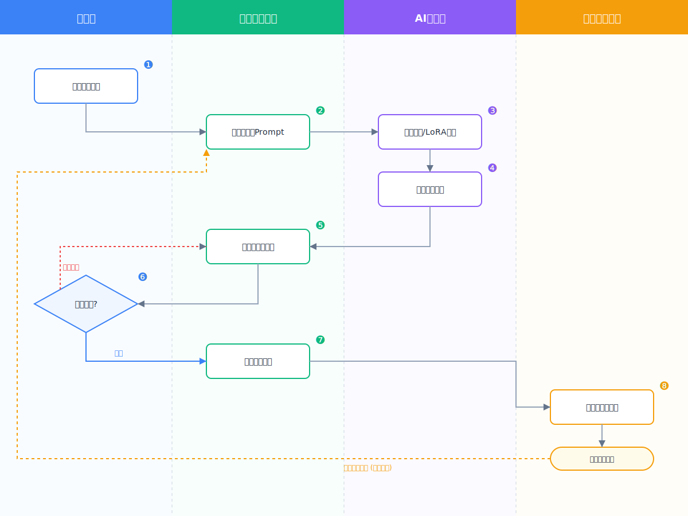

<div align="center">

# Smart Flowchart Generator
# 智能流程图生成器

<p>
    <a href="#-english-version">English</a> •
    <a href="#-中文版本">中文</a>
</p>

</div>

---

<a id="-english-version"></a>
## 🇬🇧 English Version

### 📖 Introduction

**Smart Flowchart Generator** is designed to bridge the gap between human thought and visual representation. Instead of manually dragging and dropping nodes in a GUI tool, you can simply describe your process in plain text, and this skill will handle the rest. It employs a rigorous "Chain of Thought" approach to ensure accuracy, logical coherence, and aesthetic quality.

### ✨ Features

- **Natural Language Input**: Accepts paragraphs, lists, pseudocode, or rough notes.
- **6-Phase Pipeline**: A robust workflow from analysis to rendering, ensuring no detail is missed.
- **Structured Output**: Generates intermediate JSON and ASCII wireframes for verification.
- **High-Quality SVG**: Produces clean, responsive, and styled SVG code ready for use.
- **Bilingual Support**: Auto-detects and supports both Chinese and English content.

### 🚀 Usage

1. **Install**: Copy the `dashchart_skill` folder to your LLM's context or skill directory.
2. **Invoke**: In your prompt, ask the AI to generate a flowchart using this skill.

   **Example Prompt**:
   > "Help me create a flowchart for a user registration system: User enters email -> System checks format -> If invalid, show error; If valid, send OTP -> User enters OTP -> System validates..."

3. **Output Example**:

   Below is an example of an AI Marketing Smart Flowchart generated by this skill:

   <div align="center">
     
   </div>

4. **Validate (Optional)**: Use the provided Python scripts to validate the intermediate JSON structure or final SVG.

### 🤖 Integration Guide

#### 1. Cursor / Trae IDE
- Create a `.cursorrules` file in your project root.
- Copy the content of `skill.md` into it.
- Or simply reference it if the IDE supports reading local files: "Read `dashchart_skill/skill.md` and use it to generate flowcharts."

#### 2. Custom GPTs / Claude Projects
- **Upload**: Upload `skill.md` to the Knowledge base.
- **Instructions**: Add this to the system instructions: "Always refer to the 'Smart Flowchart Generator' skill in the knowledge base when the user asks for a flowchart."

#### 3. Dify / Coze / LangChain
- Copy the content of `skill.md` into the **System Prompt** or **Prompt** node of your agent.

### 🛠️ Pipeline Details

The skill operates through the following 6 phases:

1. **Phase 1: Input Analysis** - Identify the user's intent, key process steps, and any missing information.
2. **Phase 2: Content Optimization** - Refine the raw input into a polished, logical text description. Ambiguities are resolved here.
3. **Phase 3: Structure Decomposition** - Convert the text into a structured JSON format (`structure_schema.json`), defining nodes, edges, and types.
4. **Phase 4: Text Wireframe** - Generate a 2D grid-based ASCII representation to visualize layout and positioning before rendering.
5. **Phase 5: Visual Design** - Apply styling rules (colors, fonts, shapes) based on the context (e.g., Business, Tech, Minimal).
6. **Phase 6: SVG Generation** - Combine structure and style to produce the final SVG code.

### 📂 File Structure

```text
dashchart_skill/
├── skill.md                 # Core instruction file
├── README.md                # Documentation
├── instrucktion.md          # Detailed architecture notes
├── ai-marketing-smart-flowchart.svg # Example output
├── scripts/                 # Validation tools
│   ├── validate_structure.py
│   └── validate_svg.py
└── assets/                  # Resources
    ├── templates/           # JSON schemas & templates
    ├── examples/            # Demo outputs
    └── references/          # Design guidelines
```

### ⚠️ Limitations

- **Max Nodes**: Recommended < 30 nodes for optimal readability.
- **Static Output**: Generates static SVG, not interactive diagrams.
- **Complexity**: Extremely complex logic should be broken down into sub-processes.

### 📄 License

Project is open-source.

---

<a id="-中文版本"></a>
## 🇨🇳 中文版本

### 📖 简介

**智能流程图生成器 (Smart Flowchart Generator)** 旨在填补人类思维与视觉表达之间的鸿沟。无需在 GUI 工具中手动拖拽节点，您只需用自然语言描述流程，本 Skill 即可搞定一切。它采用严谨的“思维链”方法，确保流程图的准确性、逻辑连贯性和美学质量。

### ✨ 特性

- **自然语言输入**：接受段落、列表、伪代码或粗略笔记。
- **6 阶段流水线**：从分析到渲染的稳健工作流，确保不遗漏任何细节。
- **结构化输出**：生成中间 JSON 和 ASCII 线框图以供验证。
- **高质量 SVG**：生成干净、响应式且带有样式的 SVG 代码，即插即用。
- **双语支持**：自动检测并支持中文和英文内容。

### 🚀 使用方法

1. **安装**：将 `dashchart_skill` 文件夹复制到您的 LLM 上下文或技能目录中。
2. **调用**：在提示词中，要求 AI 使用此 Skill 生成流程图。

   **调用示例**：
   > “帮我生成一个用户注册系统的流程图：用户输入邮箱 -> 系统检查格式 -> 若无效显示错误；若有效发送验证码 -> 用户输入验证码 -> 系统验证...”

3. **输出案例**：

   下图是使用本 Skill 生成的“AI 营销智能流程图”案例：

   <div align="center">
     
   </div>

4. **验证（可选）**：使用提供的 Python 脚本验证中间 JSON 结构或最终 SVG。

### 🤖 集成指南

#### 1. Cursor / Trae IDE
- 在项目根目录创建 `.cursorrules` 文件。
- 将 `skill.md` 的内容复制进去。
- 或者直接在对话中引用：“读取 `dashchart_skill/skill.md` 并用它生成流程图。”

#### 2. Custom GPTs / Claude Projects
- **上传**：将 `skill.md` 上传至知识库 (Knowledge)。
- **指令**：在系统提示词 (Instructions) 中添加：“当用户请求生成流程图时，始终参考知识库中的‘智能流程图生成器’技能。”

#### 3. Dify / Coze (扣子) / LangChain
- 将 `skill.md` 的完整内容复制到 Agent 的 **System Prompt (系统提示词)** 或 **Prompt 节点** 中。

### 🛠️ 流水线详情

本 Skill 通过以下 6 个阶段运行：

1. **阶段 1: 输入分析** - 识别用户意图、关键流程步骤以及任何缺失的信息。
2. **阶段 2: 内容优化** - 将原始输入优化为通顺、逻辑清晰的文本描述。在此阶段解决歧义。
3. **阶段 3: 结构拆解** - 将文本转换为结构化 JSON 格式（`structure_schema.json`），定义节点、连线和类型。
4. **阶段 4: 文本线框** - 生成基于网格的 2D ASCII 表示，以便在渲染前可视化布局和定位。
5. **阶段 5: 视觉设计** - 根据上下文（如商业、科技、极简）应用样式规则（颜色、字体、形状）。
6. **阶段 6: SVG 生成** - 结合结构和样式生成最终的 SVG 代码。

### 📂 文件结构

```text
dashchart_skill/
├── skill.md                 # 核心指令文件
├── README.md                # 使用文档
├── instrucktion.md          # 详细架构笔记
├── ai-marketing-smart-flowchart.svg # 案例图片
├── scripts/                 # 验证工具
│   ├── validate_structure.py
│   └── validate_svg.py
└── assets/                  # 资源文件
    ├── templates/           # JSON Schema 与模板
    ├── examples/            # 完整演示案例
    └── references/          # 设计规范与指南
```

### ⚠️ 限制

- **最大节点数**：建议小于 30 个节点以获得最佳可读性。
- **静态输出**：生成静态 SVG，非交互式图表。
- **复杂度**：极复杂的逻辑应拆分为子流程。

### 📄 许可证

本项目开源。
